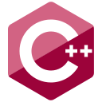

<h1 align="center"> Hi 👋, I'm Gnanavel Kumaran 🙂</h1>

 
-------  
- 🔭 I’m currently working on **SpringBoot**
- 🌱 I’m currently learning **Integration**
- 📫 How to reach me: <a href="https://www.linkedin.com/in/gnanavel-kumaran-g-281123176/">LinkedIn</a>
- ⚡ Fun fact: Big Fan of **Batman**, **Black Panther** and **Captain America** 

-------  
<h3>Languages and Tools:</h3>

  
  
  
  
  
  
   
  
  
  
  
  

  
  
  
